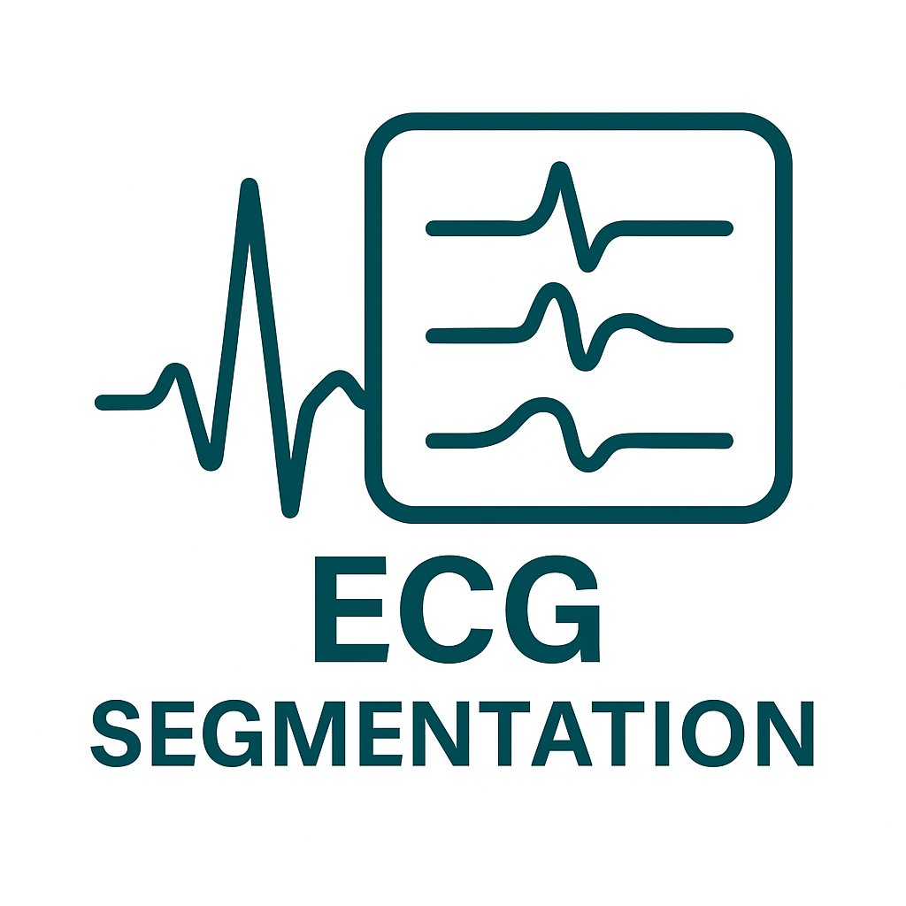

  

# ECG_Segmantation
Segment P, QRS, T using the QTDataset

## Dataset
We use the QTDataset for this project, and you can download the dataset from [this link](https://emckclac-my.sharepoint.com/:u:/g/personal/k21066681_kcl_ac_uk/EYLqOuvftNFGih_YqlY_ks4B7t5-fPuPbGKz9yT5L3p1TA?e=K6mHk6). After finishing downloading, please unzip the dataset and change the dataset path in the notebook.

## Notebook
We provide the essential code for developing the ECG segmentation model based on LSTM. including: ECG signal visualization, wavelet analysis, bandpass filter, dataset, training and validation part, etc. Please refer to this [`notebook`](train_lstm.ipynb) for more details.

## Contact Details
If you have any question, please raise an issue or send an email to jiayu.huo@kcl.ac.uk.

